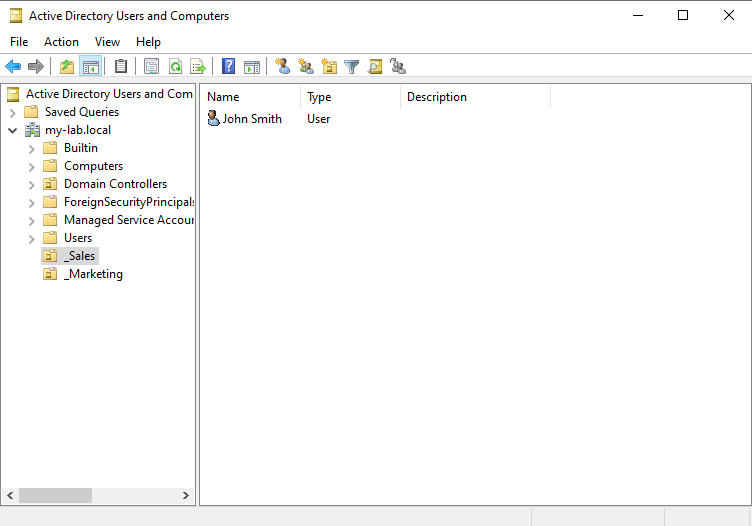

# Lab: 01 - Active Directory Configuration

### Objective:
To install and configure Active Directory Domain Services (AD DS) on the Windows Server 2022 VM, establishing it as the Domain Controller for our simulated network, `my-lab.local`.

### Steps Taken:
1.  **Role Installation:** Used Server Manager to install the "Active Directory Domain Services" role and all of its required features.
2.  **Server Promotion:** After the role installation, I promoted the server to a Domain Controller and configured a new forest named `my-lab.local`.
3.  **Set DSRM Password:** Created a secure Directory Services Restore Mode (DSRM) password for disaster recovery purposes.
4.  **Verification:** After the server rebooted automatically, I logged in and verified that the login prompt was for the new domain (`MY-LAB\Administrator`) and that the AD DS and DNS roles were showing as active in the Server Manager dashboard.
5.  **OU Creation:** Opened the "Active Directory Users and Computers" tool and created two Organizational Units (OUs): `_Sales` and `_Marketing` to segment user accounts.
6.  **User Creation:** Created two sample user accounts within each OU and assigned them initial passwords.

### Screenshot:
*Figure 1: The Server Manager dashboard showing that the AD DS and DNS roles are installed and running correctly.*

*Figure 2: The Active Directory Users and Computers console showing the new OU structure and user accounts.*

### Challenges & Learnings:
A key learning was the importance of setting a static IP address on the server *before* promoting it to a Domain Controller. The process also clarified the difference between installing a "role" (the software) and configuring it by "promoting" the server (the setup).
